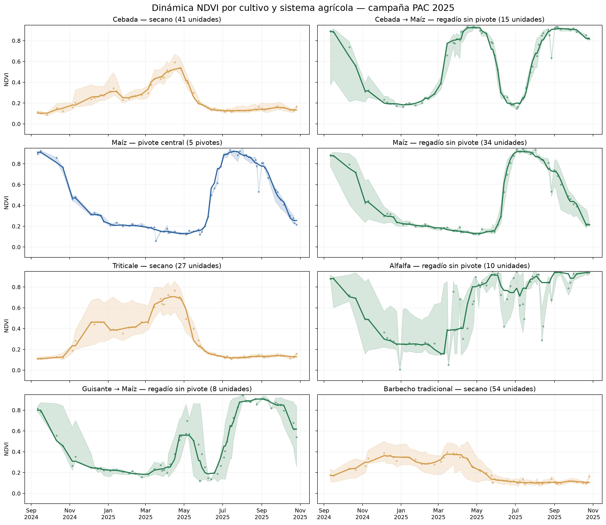
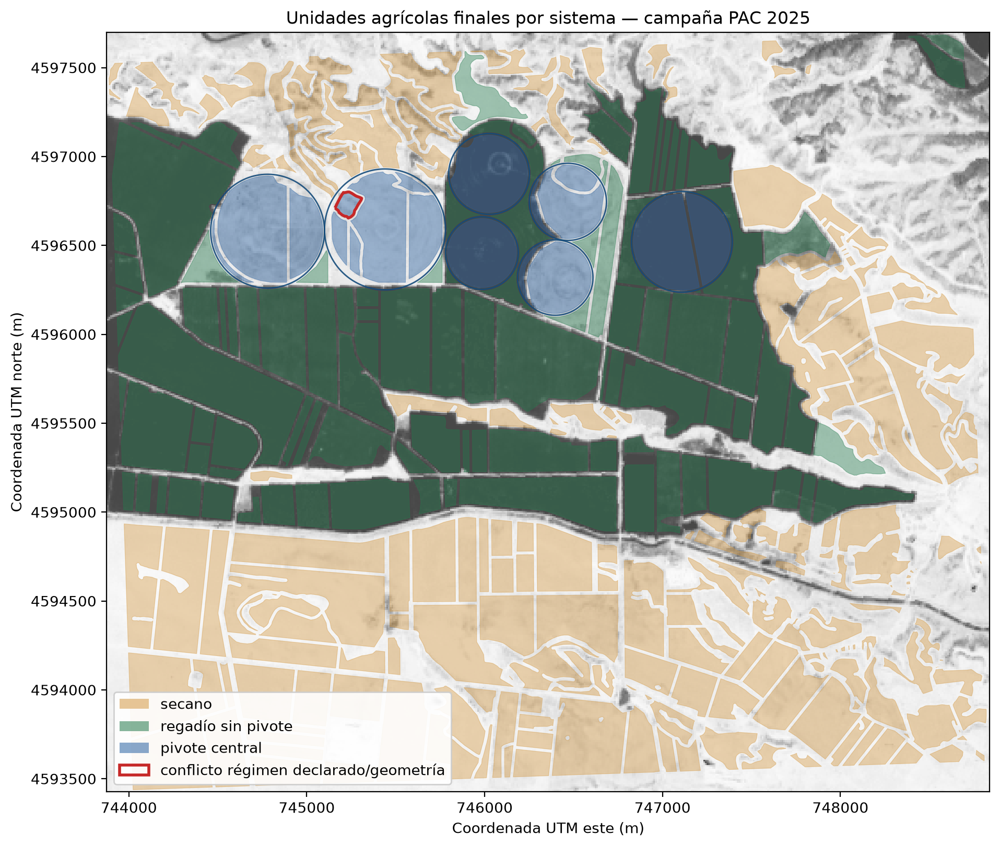
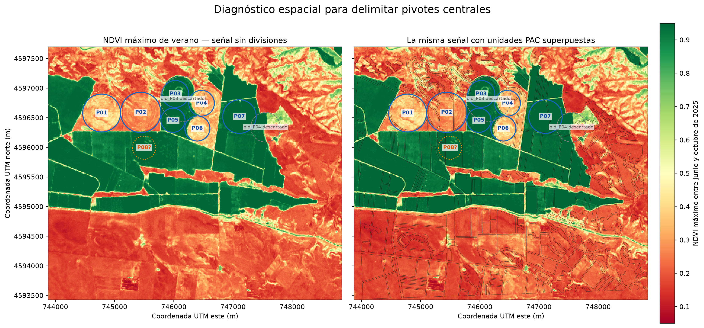

# Monegros Crop Phenology

**Análisis de la dinámica estacional de cultivos de secano, regadío y pivote
central en Monegros II mediante Sentinel-2 y declaraciones PAC/SIGPAC.**

**[Dashboard en vivo](https://monegros-crop-phenology.streamlit.app/)**

## ¿Qué estudia este proyecto?

Monegros II reúne, en un espacio agrícola muy compacto, parcelas de secano,
regadío convencional, dobles cosechas y campos regados mediante pivote central.
Esa convivencia permite estudiar cómo cambia la actividad vegetal a lo largo
de una campaña y hasta qué punto cada cultivo y sistema deja una señal temporal
distinta en el NDVI.

El proyecto cruza las declaraciones PAC/SIGPAC de 2025 con **87 observaciones
Sentinel-2 L2A**, desde septiembre de 2024 hasta octubre de 2025. El resultado
es una serie temporal formada por **261 unidades agrícolas** y **22.707
observaciones unidad-fecha**.

## Resultado principal

Los sistemas agrícolas muestran patrones fenológicos claramente distintos:

- Los **cereales de invierno de secano** presentan un único ciclo: crecimiento
  progresivo durante invierno y primavera, máximo entre abril y mayo y caída
  rápida tras la maduración y cosecha.
- Las secuencias de **doble cultivo en regadío** muestran dos máximos separados:
  uno primaveral para el primer cultivo y otro estival para el maíz.
- El **maíz en pivote y fuera de pivote** alcanza prácticamente el mismo máximo
  agregado, alrededor de 0,92 NDVI en julio. La semejanza describe la campaña,
  pero no demuestra equivalencia entre sistemas de riego.
- La **alfalfa** conserva actividad elevada durante gran parte del periodo de
  riego y muestra oscilaciones compatibles con sucesivos cortes y rebrotes.
- El **barbecho** mantiene valores mucho menores; su máximo primaveral refleja
  principalmente vegetación espontánea, no un ciclo productivo comparable.



## Resultados destacados

Los máximos corresponden a la mediana móvil centrada de 30 días. En las dobles
cosechas se informa por separado del primer y del segundo ciclo.

| Cultivo o secuencia | Sistema | Muestra válida | Máximo observado |
|---|---|---:|---|
| Cebada | Secano | 41 unidades | 0,535 · abril de 2025 |
| Triticale | Secano | 27 unidades | 0,707 · abril de 2025 |
| Maíz | Regadío sin pivote | 34 unidades | 0,920 · julio de 2025 |
| Maíz | Pivote central | 5 pivotes físicos | 0,921 · julio de 2025 |
| Cebada → maíz | Regadío sin pivote | 15 unidades | 0,925 · abril / 0,916 · septiembre |
| Guisante → maíz | Regadío sin pivote | 8 unidades | 0,560 · abril / 0,907 · agosto |
| Alfalfa | Regadío sin pivote | 10 unidades | 0,940 · septiembre de 2025 |

En total se conservan **17 combinaciones cultivo-sistema** con al menos tres
muestras físicas y alguna fecha agregada válida.

## Área de estudio

El AOI cubre aproximadamente **20 km²** de la provincia de Huesca. Tras los
filtros geométricos y de calidad, las unidades analizadas suman unas **1.189
hectáreas**:

| Sistema | Unidades de análisis | Superficie aproximada |
|---|---:|---:|
| Secano | 152 | 586 ha |
| Regadío sin pivote | 91 | 477 ha |
| Pivote central | 18 fragmentos | 126 ha |



Se confirmaron manualmente siete huellas de pivote (`P01`–`P07`). El candidato
`P08` se excluyó por falta de evidencia geométrica suficiente.



## Cómo se obtuvo, en breve

1. Se recortaron las declaraciones PAC/SIGPAC 2025 al área de estudio.
2. Las geometrías se separaron en secano, regadío sin pivote y pivote central.
3. Se aplicó un buffer interior de 10 m y se exigieron al menos 20 píxeles por
   unidad para reducir la mezcla en bordes.
4. En cada fecha se conservaron únicamente píxeles Sentinel-2 válidos de suelo
   desnudo o vegetación y se exigió al menos un 80 % de cobertura válida.
5. Se calculó el NDVI mediano de cada unidad. Dentro de los pivotes, los
   fragmentos PAC pertenecientes al mismo pivote físico se combinaron antes de
   agregar la curva.
6. Para cada cultivo y sistema se obtuvo la mediana, el rango intercuartílico y
   una mediana móvil centrada de 30 días.

Este diseño evita que una parcela grande o un pivote dividido en varios
fragmentos tenga más peso únicamente por su geometría administrativa.

## Datos

| Elemento | Contenido |
|---|---|
| Área | Monegros II, Huesca |
| Periodo | 2024-09-01 — 2025-10-31 |
| Satélite | Sentinel-2 L2A |
| Resolución | 10 m |
| Bandas | B04, B08, SCL y `dataMask` |
| Cultivos | Declaraciones PAC/SIGPAC 2025 |
| Índice | NDVI |
| Escala de análisis | Unidad agrícola; pivote físico dentro de pivotes |

El periodo comienza en septiembre de 2024 para capturar el establecimiento de
los cultivos de invierno declarados en la campaña 2025.

## Explorador interactivo

El dashboard Streamlit no constituye el resultado del análisis: es la forma de
consultarlo. Permite combinar cultivos, cambiar entre los tres sistemas,
recorrer 14 mosaicos mensuales y comparar curvas, rangos intercuartílicos y
calendarios fenológicos orientativos.

El enlace público se añadirá aquí cuando finalice el despliegue en Streamlit
Community Cloud.

Para ejecutarlo localmente:

```bash
python -m venv .venv
source .venv/bin/activate
pip install -r requirements.txt
streamlit run dashboard/streamlit_app.py
```

## Contenido del repositorio

Este repositorio es un **escaparate reproducible de resultados**:

```text
.
├── .streamlit/          # Configuración visual de Streamlit
├── dashboard/           # Aplicación y datos ligeros publicados
│   ├── app_data/
│   ├── README.md
│   └── streamlit_app.py
├── analysis/            # Flujos ejecutables del análisis
├── monegros_ndvi/       # Lógica geoespacial y fenológica reutilizable
├── output_figures/      # Figuras principales del estudio
├── tests/               # Controles metodológicos automatizados
├── data_reference/      # Correspondencia de códigos de cultivo
├── data_sentinel2/      # Instrucciones para los rásteres fuente
├── data_sigpac/         # Instrucciones para los GeoPackage fuente
├── README.md
└── requirements.txt
```

- `output_figures/` presenta directamente las evidencias principales.
- `dashboard/` contiene el explorador bilingüe y todos sus datos versionables.
- `analysis/` reúne la descarga, delimitación, análisis NDVI y preparación de
  productos publicados.
- `monegros_ndvi/` contiene las funciones compartidas por esos flujos.
- `tests/` protege las reglas metodológicas y los calendarios fenológicos.

Los GeoPackage originales, los GeoTIFF Sentinel-2, las credenciales y los
resultados de trabajo pesados no se publican.

Los flujos se ejecutan desde la raíz como módulos, por ejemplo:

```bash
python -m analysis.sentinel2 plan
python -m analysis.analyze_crop_ndvi
python -m analysis.prepare_streamlit_data
```

## Calendarios fenológicos

Las ventanas orientativas de siembra y recolección se apoyan en:

- [Calendario de siembra, recolección y comercialización para Aragón — MAPA](https://www.mapa.gob.es/es/estadistica/temas/estadisticas-agrarias/02-aragon_tcm30-514168.pdf),
  utilizando las tablas provinciales de Huesca.
- [*Cebada y maíz rastrojero* — Gobierno de Aragón](https://bibliotecavirtual.aragon.es/es/catalogo_imagenes/grupo.do?path=3707927),
  basado en ensayos en nuevos regadíos de Monegros y Cinco Villas.

Las fases intermedias se aproximan entre ambos hitos. No representan fechas de
siembra o cosecha observadas individualmente en cada parcela.

## Limitaciones

- El estudio es descriptivo y se limita a una única campaña y un AOI pequeño.
- Los cultivos proceden de declaraciones PAC; no se verificaron todos en campo.
- Los grupos tienen tamaños de muestra muy distintos.
- La curva de maíz en pivote representa cinco pivotes físicos. Cuatro de las
  huellas proceden de una misma declaración PAC, por lo que no deben tratarse
  como réplicas agrícolas completamente independientes.
- La nubosidad y las sombras reducen la disponibilidad de observaciones en
  determinadas fechas.
- Las diferencias entre sistemas no se interpretan como efectos causales del
  riego: cultivo, suelo, variedad y manejo también pueden explicarlas.

## Tecnologías

| Etapa | Tecnología |
|---|---|
| Datos geoespaciales | GeoPandas · Rasterio · Pyogrio |
| Procesamiento | Python · Pandas · NumPy |
| Teledetección | Sentinel-2 L2A · Copernicus Data Space |
| Visualización | Matplotlib · Plotly |
| Explorador | Streamlit |
| Validación | `unittest` |

## Autora

**Helena Alcolea Ruiz** · Física (Grado y Máster en Sistemas Complejos) · Data
Scientist · [GitHub](https://github.com/Helena-Alcolea)

Proyecto independiente de portfolio basado en datos públicos; no está afiliado
ni respaldado por Copernicus, el Gobierno de Aragón o el Ministerio de
Agricultura, Pesca y Alimentación.
